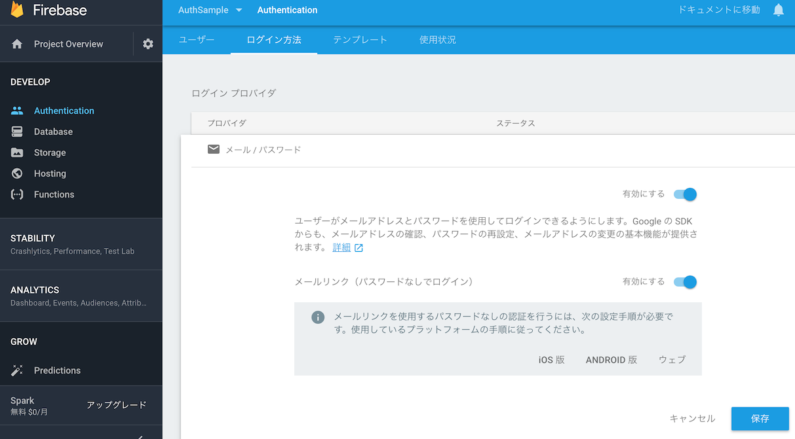

# Firebase Authentication のパスワードレス認証を試してみた

## はじめに

導入方法は[こちら][1]です。
[GitHub][2]にソースコードをあげています。

### 環境

- macOS Sierra (10.12.6)
- Android Studio 3.1.1

## 手順

公式ドキュメントに記載されていますが、簡単にまとめます。

1. Android Studioのプロジェクトをセットアップ
   - Firebaseをプロジェクトに導入
   - `app/build.gradle`にライブラリを追加
   ```
   implementation 'com.google.firebase:firebase-auth:15.0.0'
   implementation 'com.google.android.gms:play-services-auth:15.0.0'
   ```
1. Firebase ConsoleでAuthenticationのメール認証およびパスワードレス認証を有効にする
   - [Authentication] -> [ログイン方法] -> [メール / パスワード]
   
1. ユーザーのメールアドレスに認証リンクを送信する
1. メールのリンクからサインインする


[1]:https://firebase.google.com/docs/auth/android/email-link-auth
[2]:https://github.com/sadashi-ota/firebase_auth_sample_android